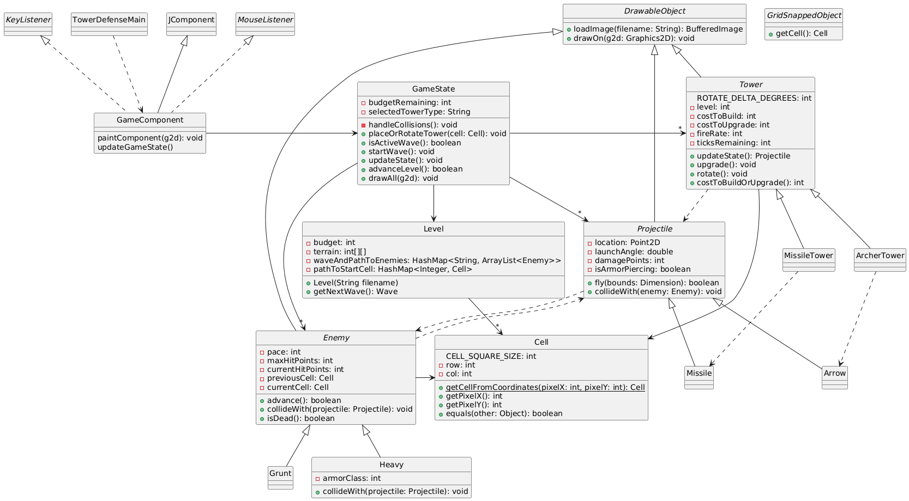

# README for CSSE 220 Tower Defense Game
Created by Ian Ludden in Fall 2025 to check the difficulty level of a tower defense game idea proposed by a project team. 

## Initial UML Design


([PlantUML link](https://www.plantuml.com/plantuml/uml/bLNVRzis47xdNq7qILdYFkJHA8AgjfTaI-RCTj1rHH6SoRFDbI8rad9Y1FtVnnyo9St8WBr8keztn_i-tb4VhGFZcaeI-rse6WnKrBg3HFyqWeKLIWYJO2rTwMSqKzoWidWFGj5NGduS5w-XmeckQgrGEOel3XMtz9SE4bKjiV9VbjxhnkATiDu7pGNz5Gz7mwUiVMQNmuhj9JyRqxqMd3Gr1uTXewNp7yLPjti6VOBHkk5RT0kiV2QXjcFg4vAHHOdC8OyiLeSQntJfZ5ydenqeBdtrKWehjBB5SSVpMWB3kLdea3j65Wob7DE9VsOlOKlcn1u_mnv3x5fhYQ38UHGtejataKW4CWXy3uhX7UvH3X9m0y-bb7qLCkVetV5jQJeqnlEErjTlNx-HqRFVlrJy0TnkfMSAAu5sJ6_0xkwX_f0qkA2b3ul7y26u7AwkoAYE4Sl08T3jOcwLmsqukG1VaVDKTyf4DqAYWWhFoBclwZTyoGA4ToWVrjOPO8uc7bFF4TOIv-k_q8Elv5nguBSLRB5ea-Mpyba-DPiD6amEIQ6v2WADwRM1UYUOlPpsnF8weDa0Gxyi-591NIFlzjfY91Vg2-zXVLtRvuu-gNOnNvMhsTDqThSg_VDwCPijsxEGGPVscsdhLlfJ8oGV88_rrW375ji8WmjmHzC9zjqE6_caWnwC3fK8YNuf9UiQo-XXe_Mgc9l7x1qJvyOg3TkX6T9ErcldT2-i5HBVy3eHiQloRIL7KZDmGYjFIlkABgSUWaQnNQcsqcl2TUFzoOX3EFleOrkbX2rDfSs3GCEYL7c4Dl9Gh7MZk7UTYWfL6F7-ZB4mznm_2xShCFJ-cCOHE1cuqXZzdCllCJgLvKsleInfe_zGf0Psx8KANcw46v1cZJ6etB_Xsk1UwCPEyasLNJieNph5MrhKkVH-a_KklIa2xqTtjx5fkdz0ujZNw0PXVpXP7a4um8dtI3p-Jp4vTM3cSqrcTtTFozyVoyNiQNdxvwmLnXzVdZtPRl9g7JZ1VhJtmCz6LnEj3HSA7DgY5Yye_uY-5pGQNw9nTbJHnpr4d-COPUHBHl3l1gGjjDkX6TDqkaFTJdwjxzzV3N-fP63HqLNtpoFvAy3nCXv0xtvwboRp18tQdw2z6uNqxm9VKve1SXp-3BS08LrinDC6yHdiVkeSt0SJwkk8wgR0R4LcgSO4a8-eU5F9Vm00))

Raw PlantUML:
```PlantUML
@startuml
skinparam style strictuml 

class TowerDefenseMain {

}

class GameComponent extends JComponent implements MouseListener, KeyListener {
paintComponent(g2d): void
updateGameState()
}

class GameState {
-budgetRemaining: int
-selectedTowerType: String
-handleCollisions(): void
+placeOrRotateTower(cell: Cell): void
+isActiveWave(): boolean
+startWave(): void
+updateState(): void
+advanceLevel(): boolean
+drawAll(g2d): void
}

class Level {
-budget: int
-terrain: int[][]
-waveAndPathToEnemies: HashMap<String, ArrayList<Enemy>>
-pathToStartCell: HashMap<Integer, Cell>
+Level(String filename)
+getNextWave(): Wave
}

abstract class DrawableObject {
+loadImage(filename: String): BufferedImage
+drawOn(g2d: Graphics2D): void
}

interface GridSnappedObject {
+getCell(): Cell
}

abstract class Tower extends DrawableObject {
ROTATE_DELTA_DEGREES: int
-level: int
-costToBuild: int
-costToUpgrade: int
-fireRate: int
-ticksRemaining: int
+updateState(): Projectile
+upgrade(): void
+rotate(): void
+costToBuildOrUpgrade(): int
}

class ArcherTower extends Tower {
}

class MissileTower extends Tower {
}

abstract class Projectile extends DrawableObject {
-location: Point2D
-launchAngle: double
-damagePoints: int
-isArmorPiercing: boolean
+fly(bounds: Dimension): boolean
+collideWith(enemy: Enemy): void
}

class Arrow extends Projectile {
}

class Missile extends Projectile {
}

abstract class Enemy extends DrawableObject {
-pace: int
-maxHitPoints: int
-currentHitPoints: int
-previousCell: Cell
-currentCell: Cell
+advance(): boolean
+collideWith(projectile: Projectile): void
+isDead(): boolean
}

class Grunt extends Enemy {
}

class Heavy extends Enemy {
-armorClass: int
+collideWith(projectile: Projectile): void
}

class Cell {
CELL_SQUARE_SIZE: int
-row: int
-col: int
+{static}getCellFromCoordinates(pixelX: int, pixelY: int): Cell
+getPixelX(): int
+getPixelY(): int
+equals(other: Object): boolean
}

TowerDefenseMain ..> GameComponent
GameComponent -> GameState
GameState -> Level
GameState ->"*" Tower
GameState ->"*" Enemy
GameState ->"*" Projectile

ArcherTower ..> Arrow
MissileTower ..> Missile

Projectile ..> Enemy
Enemy ..> Projectile
Tower ..> Projectile

Tower -> Cell
Enemy -> Cell
Level ->"*" Cell
@enduml
```